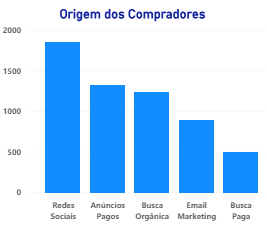

# Crie um painel gerencial automatizado utilizando Power BI

 PowerBI na prática, desafio do curso da DNC. 

> Extraia informações, construa gráficos e organize um dashboard gerencial contendo as informações mais relevantes para uma agência de marketing digital. Você definirá as visualizações que trarão mais informações para a gestão da agência e trabalhará para garantir que os dados sejam simples de serem analisados e estejam devidamente atualizados.

## 1. Contexto

A empresa de Marketing Digital "X" precisa atingir uma meta ambiciosa neste
trimestre e precisa identificar os melhores planos de ação para alcançá-la. Para
isso, ela decidiu criar um dashboard no Power BI que permita acompanhar os
principais indicadores de desempenho. Com esses dados, a equipe poderá avaliar o
desempenho de cada campanha, identificar oportunidades de otimização e escolher
os melhores planos de ação para alcançar a meta do quarter. O dashboard será
uma ferramenta essencial para a tomada de decisão mais informada e estratégica.

## 2. Sobre os dados

Com base no contexto fornecido, você como analista de Marketing precisa realizar
um Painel (Dashboard) para visualização dos dados
Para isso, deverá realizar um Power BI, importando a base de dados, que contenha
as seguintes informações do mês de Março de 2023:
 

> Dessa forma, pede-se para criar um dashboard para permitir que a
equipe de negócios desenvolva planos de ação com o objetivo de aumentar o
número de usuários cadastrados e impulsionar o crescimento da empresa.

## 3. Resultado

Utilizou-se o CRISP-DM para a resolução do problema em dados, conforme demonstra figura abaixo.

Nesse caso, por se tratar de um modelo mais simples principalmente para visualização de dados, as etapas iniciais do CRISP-DM já foram suficientes para ajudar no entendimento dos dados. Após o business understanding e data understanding,
na plataforma PowerBI, os dados foram tratados, retirados as duplicatas, nulos e outliers.

Sendo assim, foram constatados alguns insights:

**- Origem dos compradores:** a maioria dos compradores são de redes sociais seguidos de anúncios pagos. Dessa forma, a equipe de marketing consegue direcionar mais qual grupo compra mais e repensar em estratégias para os grupos que compram menos.

